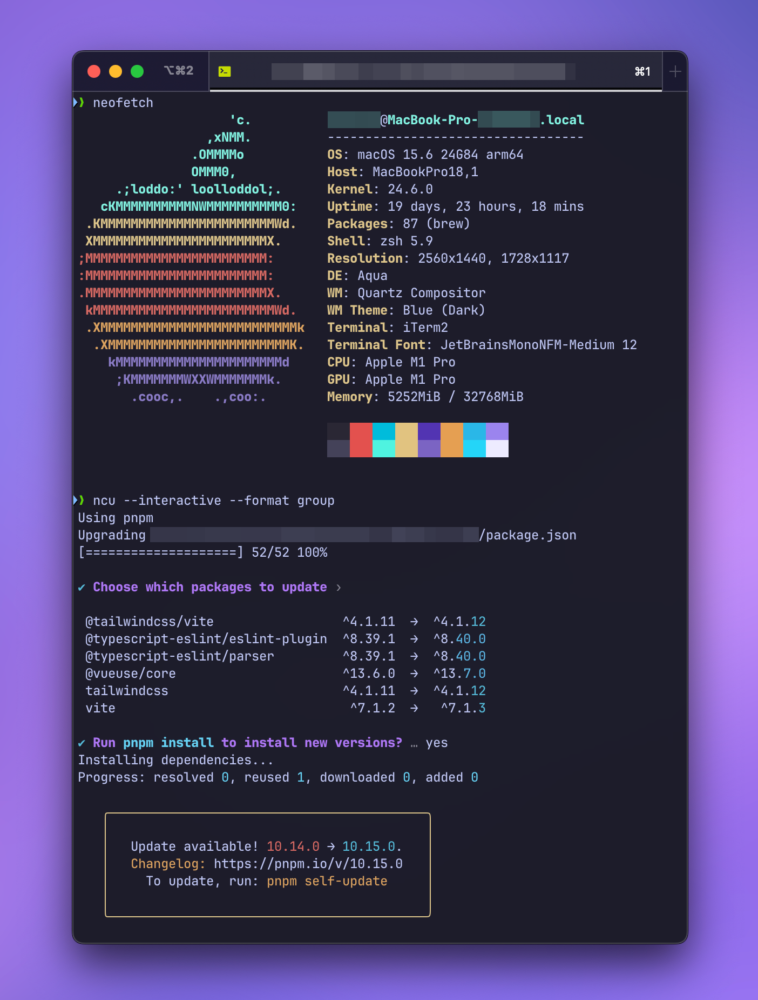

# iTerm2 – Tokyo Night Color Theme by [rojadesign](https://github.com/rojadesign)

This is a [iTerm2](https://iterm2.com/) color theme inspired by the [Tokyo Night VS Code skin](https://github.com/tokyo-night/tokyo-night-vscode-theme).

## How To Use

- Launch **iTerm2**. If not installed, get the latest version from the [official iTerm2 website](https://iterm2.com/).
- Open **`Preferences`**
- Select **`Profiles`**
- Navigate to **`Colors`** tab
- Click on **`Color Presets`**
- Click on **`Import`**
- Select the `tokyo night by rojadesign.itermcolors` file which you can view and download [here](https://github.com/rojadesign/iTerm2-Tokyo-Night-Color-Theme-by-rojadesign/blob/main/tokyo%20night%20by%20rojadesign.itermcolors).
- Alternatively, you can manually copy the color values from the [table](#colors) below into your **iTerm 2** color settings.

## Colors

| Name    | Code      | Normal    | Bright    |
| ------- | --------- | --------- | --------- |
| Black   | `#2A2734` | █ #2A2734 | █ #454258 |
| Red     | `#E2514F` | █ #E2514F | █ #E2514F |
| Green   | `#00BCDB` | █ #00BCDB | █ #4EF4E0 |
| Yellow  | `#E1C381` | █ #E1C381 | █ #E1C281 |
| Blue    | `#5234B2` | █ #5234B2 | █ #7C65C3 |
| Magenta | `#E59E50` | █ #E59E50 | █ #E59E50 |
| Cyan    | `#29B7E6` | █ #29B7E6 | █ #24D5F7 |
| White   | `#9A84EE` | █ #9A84EE | █ #EDEBFF |

## Example

